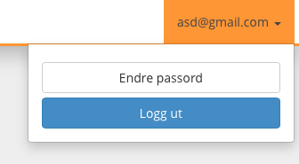

## 1 Innlogging og brukerkonto

For å kunne nå de "avanserte" funksjonene som denne applikasjonen tilgjengliggjør, må man logge seg inn på systemet. Det er for så vidt en enkel sak, om man ikke har glemt hva både e-posten og passordet er for noe. Om man husker sin egen e-post blir det straks en enklere affære. Hvis du mot formodning har glemt begge deler, ta kontakt med en av utviklerne som er listet i introduksjonen av denne manualen.

På denne papirbiten av en side, står det litt om hvordan man logger seg inn og ut, og hvordan man kan komme seg inn selv om man har glemt det forbaskede passordet atter en gang.

### 1.1 Logge seg på

Det er ingen link fra Concept sin hovedside og inn til innloggingssiden. Dette er på grunn av at denne siden ikke skal være lett synlig for offentligheten. Man må derfor enten huske linken, eller bruke denne fine brukermanualen. Den må jo bli brukt til noe.

  

<em>Et typisk adressefelt i en nettleser.</em>  

Hvis man vil logge seg på, går man direkte til `http://concept-eval.ivt.ntnu.no/concept-admin` i nettleseren. Du kan klikke [her](http://concept-eval.ivt.ntnu.no/concept-admin), så slipper du å kopiere og lime, og alt det der. For den ambisiøse bruker så er det verdt å merke seg, at hvis du allerede er inne på startsiden av presentasjonverktøyet, så legger man bare til `/concept-admin` i adressefeltet til nettleseren.

  

<em><b>Figur 1.</b> Panel for innlogging.</em>  

I dette panelet (figur 1) - som dukker opp på midten av skjermen - skriver man inn epost og tilhørende passord. Deretter klikker man på `Logg inn`, og hvis man da har gjort alt riktig, vil man bli logget inn og få et par ekstra funksjoner. Disse funksjonene blir beskrevet i en annen seksjon i denne brukermanualen.

#### 1.1.1 Nei, dette funket ikke. Jeg gir meg!

Nei, ikke gi deg! Du blir ingen superbruker med den holdningen.

  

<em><b>Figur 2.</b> Rød boks med (engelsk) feilmelding.</em>  

Fikk du røde bokser med feilmelding i (figur 2)? Disse boksene har dessverre mest sannsynlig rett. Det finnes flere grunner til at disse dukker opp:

1. Du har mistet fatningen.
2. Passord er tastet inn feil.
3. Du har glemt passordet.
4. E-post er tastet inn feil.
5. Du har ingen konto i systemet med denne epost-adressen.
6. E-post og passord er tastet inn feil.
7. Du har glemt både e-post og passord.

Her er noen tommelfinger-regler:

- Hvis du faller innenfor punkt `1`, kan vi dessverre ikke hjelpe deg.
- Hvis punkt `2`, `4` eller `6`, så prøv å logge inn igjen.
- Hvis punkt `3`, så følger du bare det som står under `Åhh nei, ikke nå igjen!`.
- Hvis punkt `5` eller `7`, så må du ta kontakt med sjefen eller en av de to studentene som er listet opp i innledningen.

### 1.2 Åhh nei, ikke nå igjen!

> \- Har du mistet passordet igjen, kjære venn?

> \- Ja, kjære webmaster.

> \- Ikke frykt mer gamle sjel, redningen er nær.

Har du en brukerkonto registrert med din egen epost-adresse, kan du gå direkte inn på denne [linken](http://concept-eval.ivt.ntnu.no/concept-admin-forgotton-password) (`http://concept-eval.ivt.ntnu.no/concept-admin-forgotton-password`). I dialogen (figur 3) oppgir du epost-adressen som du er registrert med, og trykker på knappen `Send inn`.

  

<em><b>Figur 3.</b> Panel for resetting av passord.</em>  

Du vil nå - etter et snevert øyeblikk - få en epost i din innboks. Klikk på linken i eposten. Velg deretter nytt passord ved å fylle inn de respektive feltene, og trykk på `Send inn`. Du har nå smertefritt endret passordet.

Kommer du nå til å huske passordet til neste gang? Kremt.. Kremt..

#### 1.2.1 Andre senarioer
* Du vet allerede hvordan du kommer deg til innloggingssiden, eller du er der allerede.
    1. Hvis ikke allerede gjort: Gå til http://concept-eval.ivt.ntnu.no/concept-admin
    2. Finn `glemt passord` linken og trykk på denne.
    3. Utfør samme prosedyre som over.
* Du har glemt alt, både epost og passord og vil gjerne ha tilgang til siden igjen.
    1. Du må da ta kontakt med enten sjefen, eller en av de to nevnte studentene som er listet opp i innledningen av denne brukermanualen.

<h3 style="font-weight: 600;">Visste du at ...?</h3>

Hvis man allerede er logget inn, kan man endre passordet inne under brukermenyen øverst til høyre.

### 1.3 Logge seg ut
Noen vil sikkert si:

> Spar meg. Jeg klarer vel å logge ut på egenhånd. Hva tar du meg for å være?!

Det å logge ut er ikke alltid selvforklarende. Det er ikke alltid lett å vite hvor denne logge-ut-knappen er lokalisert. Man kan lete seg ihjel etter søken på logg-ut-knapp på enkelte sider. Bruk sunt datavett og logg ut på datamaskiner som man ikke er alene om å bruke.

  

<em><b>Figur 4.</b> Meny for store skjermer.</em>  

For å logge ut av presentasjonsverktøyet, klikk øverst i høyre hjørne, der eposten din står. Deretter klikk logg ut. Hvis du er på en liten mobil enhet, trykker du på hamburger-ikonet for å se menyen (illustrert i figur 5).

  

<em><b>Figur 5.</b> Meny for mindre skjermer. Legg merke til hamburgeren øverst til høyre.</em>  

### 1.4 Legge til flere brukere

Er man litt ensom inne på sida, kan man alltids legge til flere brukere. For superbrukere finnes det en brukerhåndteringsside, som kan nåes fra menyen øverst på siden. Klikk på `Brukerhåndtering` for å komme inn på denne siden. Nederst på siden befinner det seg et felt der man kan skrive inn eposten til den personen man vil invitere. Når du har skrevet inn eposten, klikker du på `Send epost til ny bruker`, og vennen din får straks en epost med instrukser på hvordan han kan bli med i klubben.

  

<em><b>Figur 6.</b> Invitér bruker ved bruk av e-post.</em>

